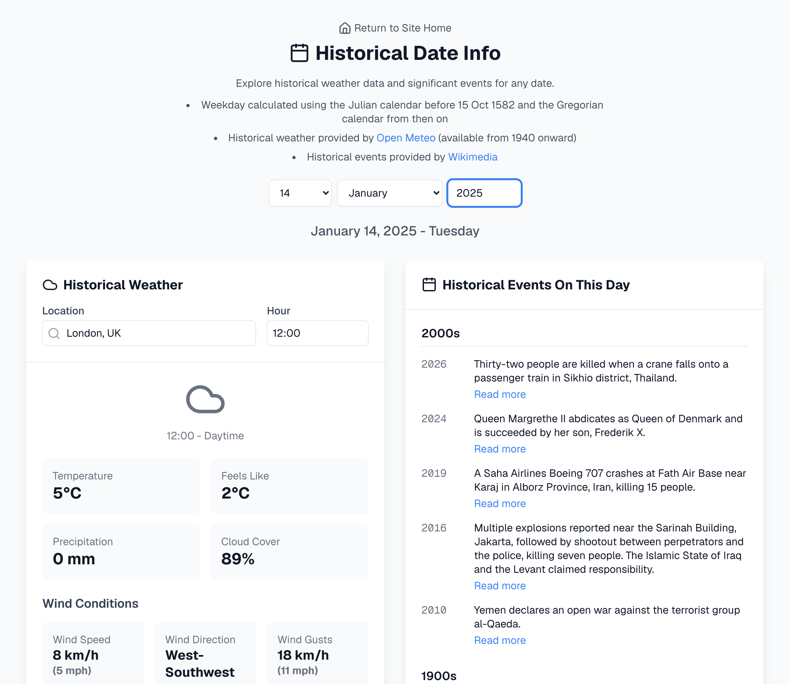

# React Your Day

A React application that shows historical weather data, weekday and significant events for any date. Built with Next.js and designed for static site integration.

## Screenshots



## Features

- Date selection for any year
- Day of week calculation via Julian Day Number, using the Julian calendar before 15 Oct 1582 and the Gregorian calendar from then on
- Flags dates in the British 1752 calendar gap (3-13 September), which never appeared on a British calendar
- Historical weather data (from 1940 onward, per the Open-Meteo archive's coverage) for locations worldwide including:
  - Temperature
  - Precipitation
  - Cloud cover
  - Wind conditions
- Wikipedia "On This Day" events organized by century
- Links to full Wikipedia articles
- Responsive design for all screen sizes
- Static site integration ready


## Setup Steps

1. Create Next.js project:
```bash
npx create-next-app@latest .
```
Select the following options:
- TypeScript: Yes
- ESLint: Yes
- Tailwind CSS: No (styling uses CSS Modules instead)
- src/ directory: Yes
- App Router: Yes
- Import alias: Yes (@/ for src/)

2. Install required dependencies:
```bash
bun add lucide-react
```

3. Create the following file structure:
```
src/
  app/
    page.tsx
    layout.tsx
    DateSelector.tsx
    DateSelector.module.css
    HistoricalDashboard.tsx
    HistoricalDashboard.module.css
    HistoricalWeather.tsx
    HistoricalWeather.module.css
    WeatherIcon.tsx
    WeatherIcon.module.css
    WikipediaOnThisDay.tsx
    WikipediaOnThisDay.module.css
    utils/
      dates.ts
```

## Development

Review `next.config.ts` to build for local development

1. Run the development server:
```bash
bun run dev
```
The app will be available at http://localhost:3000

## Building for Production

`next.config.ts` is already set to static export:
```typescript
const nextConfig = {
  output: 'export',
  images: {
    unoptimized: true,
  },
};
```

Build the static output:
```bash
bun run build
```

The static files are generated in the `out` directory.

## Deployment

Deployed to `historical-day.joshuakite.co.uk` as a static website using OpenTofu/Terraform and the [static-website-s3-cloudfront-acm](https://registry.terraform.io/modules/joshuamkite/static-website-s3-cloudfront-acm/aws) module — S3 bucket, CloudFront distribution, ACM certificate, and Route53 record. See `terraform/`.

```bash
cd terraform
tofu init
tofu apply
```

`tofu apply` builds the app (`bun install && bun run build`), syncs `out/` to S3, and invalidates the CloudFront distribution. Backend state config and domain/zone variables are supplied via a local `terraform.tfvars` (gitignored, not committed since this repo is public).

## APIs Used
The app integrates with two external APIs:

1. Wikimedia API for historical events:
```
https://api.wikimedia.org/feed/v1/wikipedia/en/onthisday/events/{month}/{day}
```

2. Open Meteo Archive API for historical weather:
```
https://archive-api.open-meteo.com/v1/archive
```

## Technologies Used
- Next.js 16
- React
- TypeScript
- CSS Modules
- Lucide React Icons
- Bun (package manager)

## Key Components
- **HistoricalDashboard**: Main application container
- **DateSelector**: Custom date input with validation
- **HistoricalWeather**: Weather data visualization
- **WikipediaOnThisDay**: Historical events display
- **WeatherIcon**: Dynamic weather condition icons
