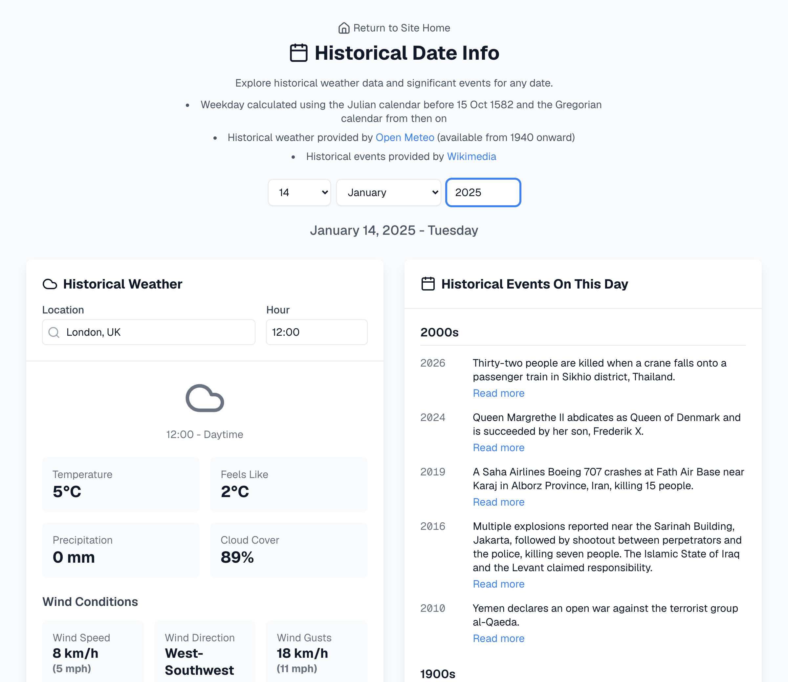

# React Your Day

A React application that shows historical weather data, weekday and significant events for any date. Built with Next.js and designed for static site integration.


## Screenshots



## Features

- Date selection for any year
- Day of week calculation via Julian Day Number, using the Julian calendar before 15 Oct 1582 and the Gregorian calendar from then on
- Flags dates in the British 1752 calendar gap (3-13 September), which never appeared on a British calendar
- Historical weather data (from 1940 onward, per the Open-Meteo archive's coverage) for locations worldwide including:
  - Temperature
  - Precipitation
  - Cloud cover
  - Wind conditions
- Wikipedia "On This Day" events organized by century
- Links to full Wikipedia articles
- Responsive design for all screen sizes
- Static site integration ready
- Footer link back to joshuakite.co.uk

## Setup

Requires [Bun](https://bun.sh).

```bash
git clone https://github.com/joshuamkite/react-your-day.git
cd react-your-day
bun install
```

## Development

Review `next.config.ts` to build for local development

1. Run the development server:
```bash
bun run dev
```
The app will be available at http://localhost:3000

2. Lint, format and test:
```bash
bun run lint     # Biome lint
bun run check    # Biome lint + format + import ordering (no writes)
bun run format   # Biome format --write
bun run test     # Vitest (unit tests for src/utils/dates.ts)
```

## Deployment

Deployed to `historical-day.joshuakite.co.uk` as a static website using OpenTofu/Terraform and the [static-website-s3-cloudfront-acm](https://registry.terraform.io/modules/joshuamkite/static-website-s3-cloudfront-acm/aws) module — S3 bucket, CloudFront distribution, ACM certificate, and Route53 record. See `terraform/`.

```bash
cd terraform
tofu init
tofu apply
```

`tofu apply` builds the app (`bun install && bun run build`), syncs `out/` to S3, and invalidates the CloudFront distribution. Backend state config and domain/zone variables are supplied via a local `terraform.tfvars` (gitignored, not committed since this repo is public).

## APIs Used
The app integrates with two external APIs:

1. Wikimedia API for historical events:
```
https://api.wikimedia.org/feed/v1/wikipedia/en/onthisday/events/{month}/{day}
```

2. Open Meteo Archive API for historical weather:
```
https://archive-api.open-meteo.com/v1/archive
```

## Key Components
- **HistoricalDashboard**: Main application container
- **DateSelector**: Custom date input with validation
- **HistoricalWeather**: Weather data visualization
- **WikipediaOnThisDay**: Historical events display
- **WeatherIcon**: Dynamic weather condition icons
